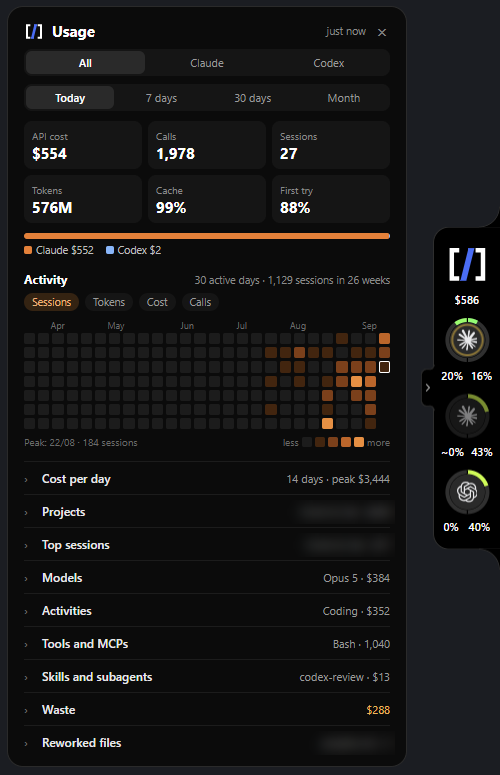

# Codenotch for Windows · NOVARC edition

The usage notch that sits on the edge of your screen and answers two questions at a glance:
**how much of my AI allowance is left**, and **how much did I burn today**.

<p align="center">
  
  &nbsp;&nbsp;
  
  &nbsp;&nbsp;
  
</p>

A free, open source fork of the Windows port of [Codenotch](https://github.com/vinzdg/codenotch),
maintained by [NOVARC](https://github.com/NovArc-Sistemas). Rust + Tauri 2 / WebView2, no
Electron, about 9 MB.

## Em português

O Codenotch é uma barrinha que fica na lateral da tela e mostra, sem abrir nada, quanto ainda
resta das suas assinaturas de IA (Claude, Codex, Cursor, Antigravity) e quanto você gastou nas
últimas 24 horas em valor equivalente de API.

Esta versão acrescenta ao port de Windows:

- **Várias contas Claude.** Um anel para cada conta em que o Claude Desktop já entrou, lido do
  cache do próprio Desktop. Não precisa de token nem de CLI.
- **Dois percentuais por anel.** Janela de 5 horas à esquerda, semanal à direita, com a cor
  indo do verde ao vermelho conforme chega perto de 100%.
- **Gasto e atividade** vindos do [codeburn](https://github.com/getagentseal/codeburn): total das
  últimas 24 horas no topo, bloco de uso no card de cada ferramenta e um painel com grade de
  atividade, projetos, sessões, modelos, ferramentas e desperdício.
- **Aba para recolher** a barrinha quando ela estiver atrapalhando.

**Como instalar:** baixe o `codenotch-windows.zip` na página de
[Releases](https://github.com/NovArc-Sistemas/codenotch-windows/releases), extraia numa pasta e
abra o `codenotch.exe`. O Windows pode avisar que o app não é assinado: clique em "Mais
informações" e depois em "Executar assim mesmo". Para ver os gastos, instale também o codeburn
com `npm i -g codeburn`.

Gratuito e de código aberto, sob a licença MIT. O design e o nome Codenotch são do autor
original, [@vinzdg](https://github.com/vinzdg); o port para Windows é de
[Im-Midi](https://github.com/Im-Midi/codenotch-windows).

## What it shows

| Cell | Source | How it reads it |
|---|---|---|
| **Spend** (top) | The local [codeburn](https://github.com/getagentseal/codeburn) CLI | API-equivalent dollars of the last 24 rolling hours, summed call by call from `codeburn export`. Shows a dash when codeburn is not installed. |
| **Claude** | Claude Desktop's own cached usage response first (`%APPDATA%\Claude\Cache\Cache_Data`, read only: no token, no request); then `GET https://api.anthropic.com/api/oauth/usage` with the token Claude Code keeps in `~/.claude/.credentials.json` | 5-hour and weekly windows, 429 back-off with a persisted deadline, stale readings dimmed with their age. A thin arc spins inside the ring while a Claude session is working, and pulses amber when one is waiting on you (Claude Code hooks and a transcript watcher, desktop app included). |
| **Claude (other accounts)** | Claude Desktop's cache, one entry per organization Desktop has been signed into | One more ring for every account besides the first, so switching accounts in Desktop keeps all of them in view. The account in use refreshes every few minutes; the others hold their last reading, dimmed and dated, and a window that has reset since shows as ~0. |
| **Codex** | The local Codex sign-in in `~/.codex/auth.json` (read only, never refreshed), falling back to the newest session snapshot | Live 5-hour and weekly windows on paid plans (a monthly window on free); Spark and Code review appear on the hover card when Codex reports them. |
| **Cursor** | The editor's own session from `state.vscdb`, then `cursor.com/api/usage-summary` | Included usage, API usage and on-demand, reset at billing-cycle end. |
| **Antigravity** | The official `agy` CLI `/usage` print when installed; otherwise the local `language_server` bridge, the Google Cloud Code API, or a transcript model count | The four official quota rows (Gemini and Claude/GPT, 5-hour and weekly). |

Providers that are not installed simply do not get a cell.

A provider with both a 5-hour and a weekly window gets a split ring: the 5-hour reading fills
the left half, the weekly one the right. Every ring and card bar shades continuously from green
through yellow to red as it nears 100 %.

### Spend and the Usage panel

With codeburn installed (`npm i -g codeburn`), the Claude and Codex cards gain a Usage block
(Today, 7 days, 30 days, Month: cost, calls, sessions, a 14-day bar chart, top models and
activities). Clicking the spend cell, or "See all" on a card, opens the Usage panel beside the
pill:

- All, Claude or Codex, over the same four periods;
- a 26-week activity grid (sessions, tokens, cost or calls per day) with the whole day on hover;
- codeburn's full analysis (cost per day, projects, top sessions, models, activities, tools and
  MCP servers, skills and subagents, waste, reworked files) in sections that open one at a time.

codeburn runs hidden in the background: today every 10 minutes, the longer periods and the
history hourly. Its figures are API-equivalent prices, not what a subscription charges, and
Claude's cover every Claude account together, because codeburn cannot tell them apart. Esc,
the × or a second click on the spend cell closes the panel.

### Folding it away

The tab on the pill's left edge folds it off the screen when it is in the way (a scrollbar,
say); only the tab stays behind, and clicking it brings the pill back. Everything else on that
edge takes clicks and scrolling as if Codenotch were not there. The choice survives a restart.

## Install

**Download:** grab `codenotch-windows.zip` from
[Releases](https://github.com/NovArc-Sistemas/codenotch-windows/releases), extract it anywhere and
run `codenotch.exe`. Keep `codenotch-hook.exe` next to it: Claude Code calls it to report when a
session is working or waiting. The binaries are not code-signed, so SmartScreen may warn on the
first run ("More info", then "Run anyway").

Requirements: Windows 11, or Windows 10 with the WebView2 runtime. Settings live in
`%APPDATA%\codenotch`.

**Build from source** (Rust with the MSVC toolchain):

```powershell
cargo build --release
.\target\release\codenotch.exe          # the pill appears on the right edge of the primary monitor
.\target\release\codenotch.exe doctor   # self-diagnosis: credentials, data sources, icons, hooks
```

## Configuration

Tray menu: **Settings…**, **Refresh usage now**, **Quit**. The settings window covers the
taskbar icon, which rings the notch shows, its size, start with Windows, the language, Claude
Code hooks, reset position and the data folder.

Two keys have no UI yet and go straight into `%APPDATA%\codenotch\config.json`:

| Key | Example | Effect |
|---|---|---|
| `claude_names` | `{"<organization uuid>": "Work"}` | Names an extra Claude ring. `codenotch doctor` lists the organizations Desktop has cached. |
| `ring_reads` | `"weekly"` | The tray icon has room for one number per provider; this makes it the weekly one instead of the 5-hour one. |

## Privacy

Everything is read from files already on your machine. The only network requests are the
providers' own usage endpoints, made with the sign-in each tool already stores locally; the
Claude Desktop cache path needs no request at all. Claude Code hooks report to a small server
bound to `127.0.0.1`. codeburn is a separate tool with its own behaviour; see its README.
Nothing is collected by Codenotch or NOVARC.

## Icons

Provider marks are the SVGs from [`@lobehub/icons-static-svg`](https://github.com/lobehub/lobe-icons)
(MIT), embedded unmodified; see `codenotch/glyphs/NOTICE.md`. Drop your own
`claude|codex|cursor|gemini.svg` (or `.png`) into `%APPDATA%\codenotch\glyphs\` to override.
The marks remain the trademarks of their owners.

## Layout

```
.
├── codenotch/          the Windows app (pill, hover card, Usage panel, settings, providers)
├── codenotch-hook/     tiny helper Claude Code calls to report session events
└── docs/               design plans for this fork's additions, README images
```

## Credits

- [Codenotch](https://github.com/vinzdg/codenotch) by [@vinzdg](https://github.com/vinzdg): the
  original macOS app, its design and its name.
- [Im-Midi/codenotch-windows](https://github.com/Im-Midi/codenotch-windows) and its contributors:
  the Windows port this fork builds on. Session detection originated in
  [Im-Midi/Pac-Man](https://github.com/Im-Midi/Pac-Man) (MIT).
- [codeburn](https://github.com/getagentseal/codeburn): the spend and activity data, called as an
  external CLI.
- NOVARC: multi-account Claude via the Desktop cache, split rings, the spend cell, the Usage
  panel and the fold tab.

This history starts from the `windows/` tree of the upstream repository, so every earlier commit
keeps its author.

## License

MIT; see `LICENSE`, which also lists the third-party notices. The Codenotch name and design
belong to the upstream author, and the NOVARC symbol is a trademark of NovArc Sistemas that is
not covered by the MIT terms.
