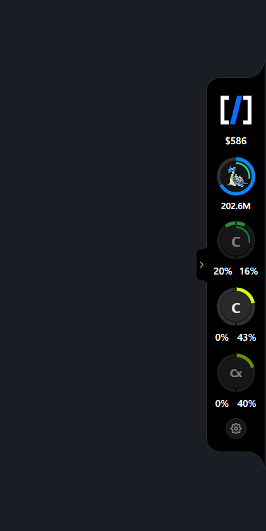
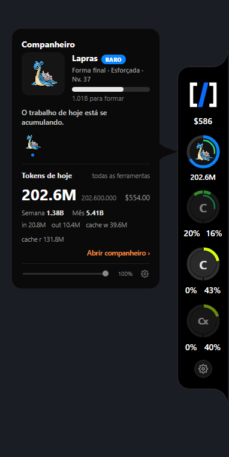
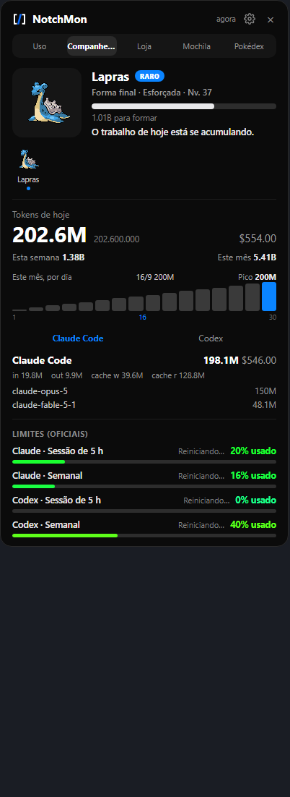
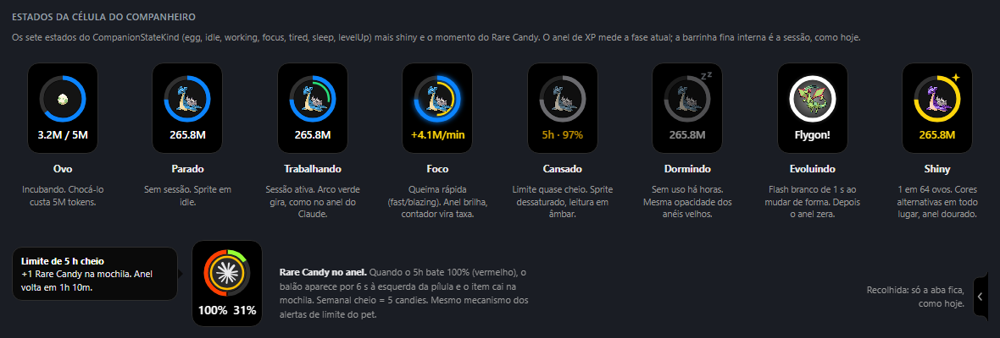
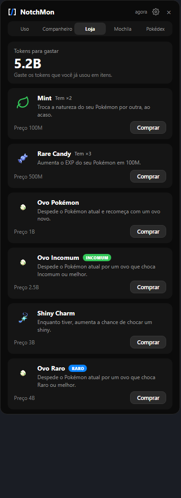
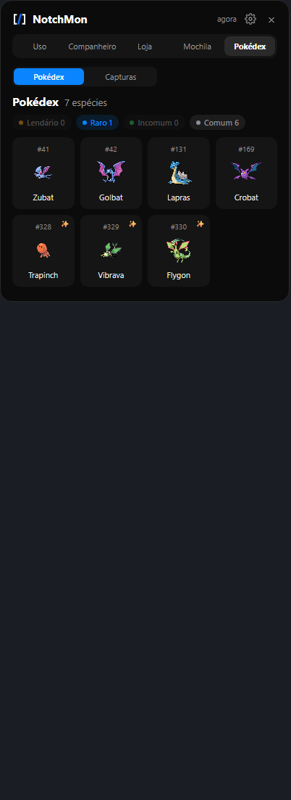
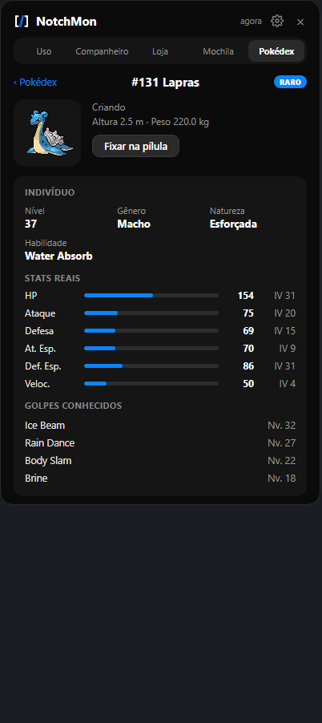
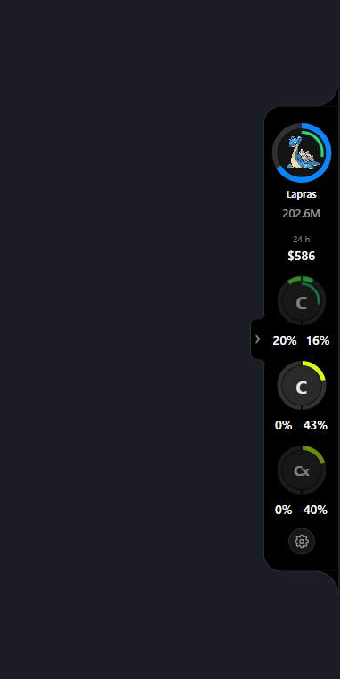
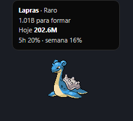
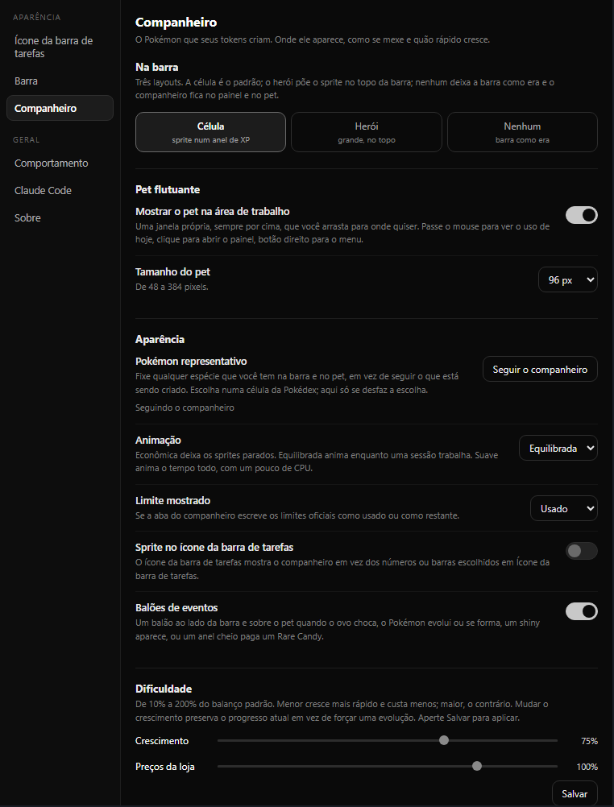

# NotchMon

**The usage notch that raises a Pokémon on your tokens.** A small pill on the edge of your
screen shows how much of your Claude, Codex, Cursor and Antigravity allowance is left and how
much you burned today; the tokens you spend incubate an egg, hatch it, evolve it through its
real line and graduate it into a Pokédex. By [NOVARC](https://github.com/NovArc-Sistemas), on
Windows, in Rust + Tauri 2. About 9 MB, no Electron.

<p align="center">
  
  &nbsp;
  
  &nbsp;
  
</p>

**English** · [Português](#em-português)

NotchMon is three things stitched into one window:

- the **glance** of [Codenotch](https://github.com/vinzdg/codenotch): rings on the edge of the
  screen, one per tool and per Claude account, 5-hour on the left, weekly on the right;
- the **detail** of [codeburn](https://github.com/getagentseal/codeburn): API-equivalent dollars,
  a 26-week activity grid, projects, models, tools, waste;
- the **game** of [PokeTokenBar](https://github.com/chattymin/PokeTokenBar), ported whole: egg,
  hatch, natures, shiny, evolution, graduation, Rare Candy, shop, bag, Pokédex, catch log,
  individual profiles, difficulty, floating pet.

## The companion

<p align="center">
  
</p>

The cell on the pill is the companion's face. Its ring is the progress of the current form; the
number under it is today's tokens. The eight states:

| State | When | What you see |
|---|---|---|
| **Egg** | No Pokémon yet | The egg and `3.2M / 5M`: tokens incubated over the 5M it takes to hatch. |
| **Idle** | A Pokémon, no session running | The sprite, still. |
| **Working** | A session is burning tokens (1K–100K a minute) | The thin green arc spins inside the ring, as it does on the Claude ring. |
| **Focus** | Fast burn (100K a minute and up) | The ring glows, the arc turns yellow, the number becomes the rate. |
| **Tired** | Any official limit past 90 % | The sprite desaturates and the number reads the 5-hour window in amber. |
| **Sleeping** | No usage today | Dimmed, with a *zz*. |
| **Evolving** | A form threshold was crossed | A white flash, the new name under the ring, and the ring starts over. |
| **Shiny** | 1 hatch in 64 (1 in 48 with the Shiny Charm) | The shiny colours everywhere, a gold ring and a star. |

**Rare Candy comes from the rings.** When a 5-hour ring reaches 100 % you get one Rare Candy
(+100M growth); a weekly ring pays five. A bubble beside the pill says so and the candy waits in
the Bag. The same bubble announces a hatch, an evolution, a graduation and a shiny.

Everything else PokeTokenBar does, NotchMon does the same way, with the same numbers:

- **Hatch** at 5M tokens, from every Gen I–V base species (328 lines), weighted by the official
  capture rate: a Caterpie hatches 85 times more often than a Mewtwo. A line you already
  graduated rolls at half weight and grows twice as fast. Every hatch rolls one of 25 natures;
  once in a while a common line hides a Ditto that reveals itself at the first evolution.
- **Evolve** through the real evolution tree from [PokéAPI](https://pokeapi.co), branches chosen
  at hatch. Graduation totals are 750M (common), 1.875B (uncommon), 3B (rare) and 6B (legendary)
  tokens, split over the forms so later ones cost more.
- **Shop**, paid in tokens you have already spent: Mint 100M (re-rolls the nature), Rare Candy
  500M, an egg 1B (sends the companion off and starts over), Uncommon Egg 2.5B, Shiny Charm 3B,
  Rare Egg 4B.
- **Pokédex**: one cell per species you own, 24 a page, rarity filters, a star on the ones you
  own shiny. **Catch log**: one card per individual, newest first, with its whole line. Open any
  cell for the **profile**: level, gender, nature, ability, IVs, calculated stats and the moves it
  knows.
- **Difficulty**: growth and shop prices from 10 % to 200 % of the default, independently.
  Changing growth keeps your progress instead of forcing an evolution.
- **Representative Pokémon**: pin any species you own to the pill and the pet.

<p align="center">
  
  &nbsp;
  
  &nbsp;
  
</p>

### Where it lives

- **On the pill**, in one of three layouts chosen in Settings: the **cell** (default, above), the
  **hero** (the sprite big at the top, spend under it) or **none** (the pill as Codenotch drew it).
- **In the hover card** of the cell: PokeTokenBar's home folded into a card, with today's tokens
  per tool.
- **In the panel**, five tabs: Uso (the codeburn panel, unchanged), Companheiro, Loja, Mochila,
  Pokédex.
- **On the desktop**, as a **floating pet**: a transparent always-on-top window, 48 to 384 px,
  that you drag anywhere. Hover it for today's usage and the limits, click it to open the panel,
  right-click it for a menu, and the same bubbles appear above it.

<p align="center">
  
  &nbsp;
  
</p>

### Where the tokens come from

NotchMon reads the tools' own transcripts, as PokeTokenBar does, with no CLI in between:
`~/.claude/projects/**/*.jsonl` (and the desktop app's session mirrors) for Claude Code,
`~/.codex/sessions/**/*.jsonl` for Codex. Files are read incrementally and every call is counted
once (`message.id|requestId`, keeping the completed one). `totalTokens` = input + output + cache
write + cache read, local calendar day. The companion grows on the difference between readings,
so nothing before the install counts, and the first reading after a new day counts everything
reported that day.

codeburn stays what it was: the dollars in the spend cell and the whole Uso tab. Its figures are
API-equivalent prices, not what a subscription charges, and cover every Claude account together.

## What the rings show

| Cell | Source | How it reads it |
|---|---|---|
| **Spend** (top) | The local [codeburn](https://github.com/getagentseal/codeburn) CLI | API-equivalent dollars of the last 24 rolling hours. A dash when codeburn is not installed. |
| **Claude** | Claude Desktop's own cached usage response first (`%APPDATA%\Claude\Cache\Cache_Data`, read only); then `GET https://api.anthropic.com/api/oauth/usage` with the token Claude Code keeps in `~/.claude/.credentials.json` | 5-hour and weekly windows, 429 back-off with a persisted deadline, stale readings dimmed with their age. A thin arc spins inside the ring while a session is working, and pulses amber when one is waiting on you. |
| **Claude (other accounts)** | Claude Desktop's cache, one entry per organization Desktop has been signed into | One more ring per account, so switching accounts in Desktop keeps all of them in view. |
| **Codex** | The local Codex sign-in in `~/.codex/auth.json` (read only), falling back to the newest session snapshot | Live 5-hour and weekly windows on paid plans (a monthly window on free). |
| **Cursor** | The editor's own session from `state.vscdb`, then `cursor.com/api/usage-summary` | Included usage, API usage and on-demand. |
| **Antigravity** | The official `agy` CLI `/usage` print when installed; otherwise the local `language_server` bridge, the Google Cloud Code API, or a transcript model count | The four official quota rows (Gemini and Claude/GPT, 5-hour and weekly). |

Providers that are not installed do not get a cell. A provider with both windows gets a split
ring, 5-hour on the left, weekly on the right; every ring and bar shades from green through
yellow to red as it nears 100 %. Clicking the spend cell, or "See all" on a card, opens the
panel on Uso; clicking the companion cell opens it on Companheiro. Esc, the × or a second click
on the same cell closes it. The tab on the pill's left edge folds it off the screen; the tab
alone stays behind.

## Install

**Download:** grab `NotchMon.zip` from
[Releases](https://github.com/NovArc-Sistemas/NotchMon/releases), extract it anywhere and run
`notchmon.exe`. Keep `notchmon-hook.exe` next to it: Claude Code calls it to report when a
session is working or waiting. The binaries are not code-signed, so SmartScreen may warn on the
first run ("More info", then "Run anyway").

Requirements: Windows 11, or Windows 10 with the WebView2 runtime. Dollars need
`npm i -g codeburn`; the companion needs nothing but your transcripts and an internet connection
for PokéAPI the first time it meets a species. Settings, readings, the companion's save and the
sprite cache live in `%APPDATA%\notchmon` (an existing `%APPDATA%\codenotch` is copied over on
the first run).

**Build from source** (Rust with the MSVC toolchain):

```powershell
cargo build --release
.\target\release\notchmon.exe          # the pill appears on the right edge of the primary monitor
.\target\release\notchmon.exe doctor   # self-diagnosis: credentials, data sources, transcripts, icons, hooks
cargo test -p notchmon                 # the engine, the readers, the PokéAPI parsing, the tray icon
```

## Settings

Four ways in: the gear at the foot of the pill, the gear in the panel's header, a right-click
anywhere on the pill, or the tray menu (**Settings…**, **Refresh usage now**, **Quit**). The settings window covers the
taskbar icon, which rings the notch shows, its size, the **Companion** (pill layout, floating pet
and its size, representative Pokémon, animation quality, used or remaining limits, event
bubbles, the sprite in the taskbar icon, difficulty), start with Windows, the language (English,
Português, and the port's original languages), Claude Code hooks, reset position and the data
folder.

<p align="center"></p>

Two keys have no UI and go straight into `%APPDATA%\notchmon\config.json`:

| Key | Example | Effect |
|---|---|---|
| `claude_names` | `{"<organization uuid>": "Work"}` | Names an extra Claude ring. `notchmon doctor` lists the organizations Desktop has cached. |
| `ring_reads` | `"weekly"` | The tray icon has room for one number per provider; this makes it the weekly one instead of the 5-hour one. |

## Privacy

Everything is read from files already on your machine. The only network requests are the
providers' own usage endpoints, made with the sign-in each tool already stores locally, and
[PokéAPI](https://pokeapi.co) plus its sprite repository for species data and sprites, which are
cached and never carry anything about you. Claude Code hooks report to a small server bound to
`127.0.0.1`. codeburn is a separate tool with its own behaviour. Nothing is collected by NotchMon
or NOVARC.

## Forking it

The repository is meant to be forked:

```
.
├── notchmon/            the app: Rust in src/, the three pages in ui/, provider marks in glyphs/
│   ├── src/tokens.rs        transcript readers (Claude Code, Codex)
│   ├── src/pokeapi.rs       PokéAPI client, disk cache, sprites
│   ├── src/companion.rs     the game engine, tested against a fake provider
│   └── ui/consumo.html      the panel and its five tabs
├── notchmon-hook/       tiny helper Claude Code calls to report session events
└── docs/                the build plans and the README images
```

Balance lives at the top of `companion.rs` (`EGG_HATCH`, `graduation_total`, the prices, the
odds). Strings for every page sit in one `PT` dictionary per page; add a language by adding a
dictionary. Provider marks are the SVGs from
[`@lobehub/icons-static-svg`](https://github.com/lobehub/lobe-icons) (MIT), see
`notchmon/glyphs/NOTICE.md`; drop your own `claude|codex|cursor|gemini.svg` into
`%APPDATA%\notchmon\glyphs\` to override them. The NOVARC symbol is not MIT: replace it in your
fork.

## Credits

- [PokeTokenBar](https://github.com/chattymin/PokeTokenBar) by [@chattymin](https://github.com/chattymin)
  (MIT): the game, its balance and its screens, ported here as faithfully as we could.
- [Codenotch](https://github.com/vinzdg/codenotch) by [@vinzdg](https://github.com/vinzdg): the
  original macOS notch, its design and the rings.
- [Im-Midi/codenotch-windows](https://github.com/Im-Midi/codenotch-windows) and its contributors:
  the Windows port this grew out of. Session detection originated in
  [Im-Midi/Pac-Man](https://github.com/Im-Midi/Pac-Man) (MIT).
- [codeburn](https://github.com/getagentseal/codeburn): the spend and activity data.
- [PokéAPI](https://pokeapi.co) and the [PokeAPI/sprites](https://github.com/PokeAPI/sprites)
  repository: species, evolution chains, battle data and the Gen V sprites, fetched at runtime.
- NOVARC: the port of the game, the transcript readers, multi-account Claude, the split rings,
  the panel, the pet and the fold tab.

## License and disclaimer

MIT; see `LICENSE`, and `NOTICE.md` for the third-party notices. NotchMon is an unofficial,
non-commercial fan project. It is not affiliated with, endorsed, sponsored or approved by
Nintendo, Game Freak, Creatures Inc. or The Pokémon Company. "Pokémon" and all related names,
characters and imagery are trademarks and copyrights of their respective owners. The app bundles
no Pokémon assets: species data and sprites are fetched at runtime from the public PokéAPI and
cached on your own machine, and the images in this README are shown only to illustrate the app.
The Codenotch name and design belong to the upstream author; the NOVARC symbol is a trademark of
NovArc Sistemas that the MIT terms do not cover.

---

## Em português

**A barrinha de uso que cria um Pokémon com os seus tokens.** O NotchMon fica na borda da tela
e mostra, sem abrir nada, quanto ainda resta das suas assinaturas de IA (Claude, Codex, Cursor,
Antigravity) e quanto você gastou hoje. Os tokens que você gasta chocam um ovo, o Pokémon evolui
pela linha evolutiva de verdade e se forma na sua Pokédex. É o [Codenotch](https://github.com/vinzdg/codenotch)
(a barrinha), o [codeburn](https://github.com/getagentseal/codeburn) (os detalhes) e o
[PokeTokenBar](https://github.com/chattymin/PokeTokenBar) (o jogo, portado por inteiro) numa
janela só, feito pela [NOVARC](https://github.com/NovArc-Sistemas) em Rust + Tauri 2.

**Como instalar:** baixe o `NotchMon.zip` na página de
[Releases](https://github.com/NovArc-Sistemas/NotchMon/releases), extraia numa pasta e abra o
`notchmon.exe`. Deixe o `notchmon-hook.exe` na mesma pasta: é ele que o Claude Code chama para
avisar quando uma sessão está trabalhando. O Windows pode avisar que o app não é assinado: clique
em "Mais informações" e depois em "Executar assim mesmo". Para ver os gastos em dólar, instale
também o codeburn com `npm i -g codeburn`. O companheiro não precisa de nada além das suas
transcrições e de internet na primeira vez que encontra uma espécie (PokéAPI).

### O companheiro

A célula na barrinha é a cara do companheiro. O anel é o progresso da forma atual; o número
embaixo são os tokens de hoje. Os oito estados da imagem lá em cima:

| Estado | Quando | O que aparece |
|---|---|---|
| **Ovo** | Ainda sem Pokémon | O ovo e `3.2M / 5M`: tokens incubados sobre os 5M que chocá-lo custa. |
| **Parado** | Tem Pokémon, nenhuma sessão rodando | O sprite, quieto. |
| **Trabalhando** | Uma sessão está queimando tokens (1K a 100K por minuto) | O arco verde fino gira dentro do anel, como no anel do Claude. |
| **Foco** | Queima rápida (100K por minuto ou mais) | O anel brilha, o arco fica amarelo e o número vira a taxa. |
| **Cansado** | Algum limite oficial passou de 90 % | O sprite perde cor e o número mostra a janela de 5 h em âmbar. |
| **Dormindo** | Nenhum uso hoje | Apagado, com um *zz*. |
| **Evoluindo** | Cruzou o limiar de uma forma | Um flash branco, o nome novo embaixo do anel, e o anel recomeça. |
| **Shiny** | 1 ovo em 64 (1 em 48 com o Shiny Charm) | As cores alternativas em todo lugar, anel dourado e uma estrela. |

**O Rare Candy nasce dos anéis.** Quando um anel de 5 h chega em 100 % você ganha um Rare Candy
(+100M de crescimento); um anel semanal paga cinco. Um balão ao lado da barrinha avisa e o doce
espera na Mochila. O mesmo balão anuncia choca, evolução, formatura e shiny.

Todo o resto é como no PokeTokenBar, com os mesmos números: chocar custa 5M tokens, entre todas
as espécies base das gerações I a V, com peso pela taxa de captura oficial; 25 naturezas; formar
custa 750M (comum), 1.875B (incomum), 3B (raro) ou 6B (lendário), divididos entre as formas; uma
linha já formada cresce 2× mais rápido; a Loja vende em tokens já gastos (Mint 100M, Rare Candy
500M, Ovo 1B, Ovo Incomum 2.5B, Shiny Charm 3B, Ovo Raro 4B); a Pokédex tem 24 espécies por
página e cada indivíduo tem perfil com nível, gênero, natureza, habilidade, IVs, stats e golpes; a
dificuldade vai de 10 % a 200 %.

### Onde ele aparece

Na barrinha (três layouts: célula, herói ou nenhum), no card ao passar o mouse, no painel (abas
Uso, Companheiro, Loja, Mochila e Pokédex) e, se você quiser, como um **pet flutuante** na área
de trabalho: uma janela transparente, sempre por cima, de 48 a 384 px, que você arrasta para
onde quiser. Passe o mouse para ver o uso de hoje, clique para abrir o painel, botão direito para
o menu.

### De onde vêm os tokens

Direto das transcrições das ferramentas, sem CLI no meio: `~/.claude/projects/**/*.jsonl` para
o Claude Code e `~/.codex/sessions/**/*.jsonl` para o Codex, lidos aos poucos e sem contar a
mesma chamada duas vezes. O companheiro cresce com a diferença entre uma leitura e a próxima,
então nada de antes da instalação conta. O codeburn continua cuidando dos dólares e da aba Uso.

### Configurações

Quatro caminhos: a engrenagem no pé da barrinha, a engrenagem no cabeçalho do painel, clique
direito em qualquer ponto da barrinha, ou o menu da bandeja (**Configurações…**, **Atualizar uso
agora**, **Sair**). A janela de
configurações tem a aba **Companheiro** (layout na barrinha, pet e tamanho, Pokémon
representativo, animação, limite mostrado como usado ou restante, balões, sprite no ícone da
bandeja, dificuldade) e o idioma, com português e inglês. Tudo fica em `%APPDATA%\notchmon`
(uma pasta `codenotch` antiga é copiada na primeira execução).

### Privacidade

Tudo é lido de arquivos que já estão na sua máquina. As únicas requisições de rede são os
endpoints de uso das próprias ferramentas, com o login que cada uma já guarda, e o PokéAPI para
os dados e sprites das espécies, que não levam nada seu. Nada é coletado pelo NotchMon nem pela
NOVARC.

Gratuito e de código aberto, sob a licença MIT. Projeto de fã, não oficial e sem fins
comerciais: não tem relação com a Nintendo, a Game Freak, a Creatures Inc. nem com a The Pokémon
Company. O app não embute nenhum material Pokémon; tudo vem do PokéAPI em tempo de execução. O
jogo é do [@chattymin](https://github.com/chattymin) (PokeTokenBar), o design e o nome Codenotch
são do [@vinzdg](https://github.com/vinzdg), o port para Windows começou com o
[Im-Midi](https://github.com/Im-Midi/codenotch-windows).
